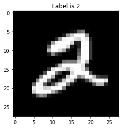
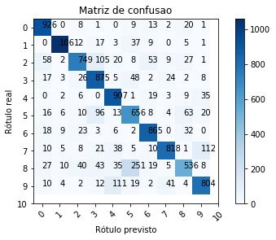

# Problema 3 - Reconhecendo dígitos manuscritos


* Minicurso Machine Learning -- Hands on com Python
* Samsung Ocean Manaus
* Facilitadora: Elloá B. Guedes
* Repositório: http://bit.ly/mlpython
* Nome:
* Email:

### Bibliotecas

A célula a seguir está reservada para importação de bibliotecas


```python
import mnist
from sklearn.neural_network import MLPClassifier
from sklearn.metrics import accuracy_score
from sklearn.neighbors import KNeighborsClassifier
from sklearn import tree
```

### Obtendo o conjunto de dados

1. Obtenha o dataset do MNIST
       1.1 Vamos utilizar o [Projeto MNIST-for-Numpy](https://github.com/hsjeong5/MNIST-for-Numpy) para nos ajudar
       1.2 Baixe o arquivo mnist.py do nosso repositório
       1.3 Coloque-o na mesma pasta do Jupyter Notebook do problema 3
       1.4 Adicione import mnist
       1.5 Faça mnist.init() para download dos arquivos
2. Particione o dataset em dados de treino e teste
       2.1 60 mil primeiros exemplos para treino
       2.2 10 mil exemplos seguintes para teste
       2.3 Conforme documentação do projeto, faça: X_train, y_train, X_test, y_test = mnist.load()
3. Imprima o exemplo no índice 5 dos dados de treino e seu respectivo rótulo
       3.1 Visualize o atributo preditor conforme array e também como imagem


```python
mnist.init()
```

    Downloading train-images-idx3-ubyte.gz...
    Downloading t10k-images-idx3-ubyte.gz...
    Downloading train-labels-idx1-ubyte.gz...
    Downloading t10k-labels-idx1-ubyte.gz...
    Download complete.
    Save complete.


```python
X_train, y_train, X_test, y_test = mnist.load()
```


```python
X_train[5]
```


    array([  0,   0,   0,   0,   0,   0,   0,   0,   0,   0,   0,   0,   0,
             0,   0,   0,   0,   0,   0,   0,   0,   0,   0,   0,   0,   0,
             0,   0,   0,   0,   0,   0,   0,   0,   0,   0,   0,   0,   0,
             0,   0,   0,   0,   0,   0,   0,   0,   0,   0,   0,   0,   0,
             0,   0,   0,   0,   0,   0,   0,   0,   0,   0,   0,   0,   0,
             0,   0,   0,   0,   0,   0,   0,   0,   0,   0,   0,   0,   0,
             0,   0,   0,   0,   0,   0,   0,   0,   0,   0,   0,   0,   0,
             0,   0,   0,   0,   0,   0,   0,   0,   0,   0,   0,   0,   0,
             0,   0,   0,   0,   0,   0,   0,   0,   0,   0,   0,   0,   0,
             0,   0,   0,   0,   0,   0,   0,   0,   0,   0,   0,   0,   0,
             0,   0,   0,   0,   0,   0,   0,   0,   0,   0,   0,   0,   0,
             0,   0,   0,   0,   0,   0,   0,   0,   0,   0,   0,   0,  13,
            25, 100, 122,   7,   0,   0,   0,   0,   0,   0,   0,   0,   0,
             0,   0,   0,   0,   0,   0,   0,   0,   0,   0,   0,   0,  33,
           151, 208, 252, 252, 252, 146,   0,   0,   0,   0,   0,   0,   0,
             0,   0,   0,   0,   0,   0,   0,   0,   0,   0,   0,   0,  40,
           152, 244, 252, 253, 224, 211, 252, 232,  40,   0,   0,   0,   0,
             0,   0,   0,   0,   0,   0,   0,   0,   0,   0,   0,   0,  15,
           152, 239, 252, 252, 252, 216,  31,  37, 252, 252,  60,   0,   0,
             0,   0,   0,   0,   0,   0,   0,   0,   0,   0,   0,   0,   0,
             0,  96, 252, 252, 252, 252, 217,  29,   0,  37, 252, 252,  60,
             0,   0,   0,   0,   0,   0,   0,   0,   0,   0,   0,   0,   0,
             0,   0,   0, 181, 252, 252, 220, 167,  30,   0,   0,  77, 252,
           252,  60,   0,   0,   0,   0,   0,   0,   0,   0,   0,   0,   0,
             0,   0,   0,   0,   0,  26, 128,  58,  22,   0,   0,   0,   0,
           100, 252, 252,  60,   0,   0,   0,   0,   0,   0,   0,   0,   0,
             0,   0,   0,   0,   0,   0,   0,   0,   0,   0,   0,   0,   0,
             0,   0, 157, 252, 252,  60,   0,   0,   0,   0,   0,   0,   0,
             0,   0,   0,   0,   0,   0,   0,   0,   0,   0,   0,   0,   0,
           110, 121, 122, 121, 202, 252, 194,   3,   0,   0,   0,   0,   0,
             0,   0,   0,   0,   0,   0,   0,   0,   0,   0,   0,   0,  10,
            53, 179, 253, 253, 255, 253, 253, 228,  35,   0,   0,   0,   0,
             0,   0,   0,   0,   0,   0,   0,   0,   0,   0,   0,   0,   5,
            54, 227, 252, 243, 228, 170, 242, 252, 252, 231, 117,   6,   0,
             0,   0,   0,   0,   0,   0,   0,   0,   0,   0,   0,   0,   0,
             6,  78, 252, 252, 125,  59,   0,  18, 208, 252, 252, 252, 252,
            87,   7,   0,   0,   0,   0,   0,   0,   0,   0,   0,   0,   0,
             0,   5, 135, 252, 252, 180,  16,   0,  21, 203, 253, 247, 129,
           173, 252, 252, 184,  66,  49,  49,   0,   0,   0,   0,   0,   0,
             0,   0,   3, 136, 252, 241, 106,  17,   0,  53, 200, 252, 216,
            65,   0,  14,  72, 163, 241, 252, 252, 223,   0,   0,   0,   0,
             0,   0,   0,   0, 105, 252, 242,  88,  18,  73, 170, 244, 252,
           126,  29,   0,   0,   0,   0,   0,  89, 180, 180,  37,   0,   0,
             0,   0,   0,   0,   0,   0, 231, 252, 245, 205, 216, 252, 252,
           252, 124,   3,   0,   0,   0,   0,   0,   0,   0,   0,   0,   0,
             0,   0,   0,   0,   0,   0,   0,   0, 207, 252, 252, 252, 252,
           178, 116,  36,   4,   0,   0,   0,   0,   0,   0,   0,   0,   0,
             0,   0,   0,   0,   0,   0,   0,   0,   0,   0,  13,  93, 143,
           121,  23,   6,   0,   0,   0,   0,   0,   0,   0,   0,   0,   0,
             0,   0,   0,   0,   0,   0,   0,   0,   0,   0,   0,   0,   0,
             0,   0,   0,   0,   0,   0,   0,   0,   0,   0,   0,   0,   0,
             0,   0,   0,   0,   0,   0,   0,   0,   0,   0,   0,   0,   0,
             0,   0,   0,   0,   0,   0,   0,   0,   0,   0,   0,   0,   0,
             0,   0,   0,   0,   0,   0,   0,   0,   0,   0,   0,   0,   0,
             0,   0,   0,   0,   0,   0,   0,   0,   0,   0,   0,   0,   0,
             0,   0,   0,   0,   0,   0,   0,   0,   0,   0,   0,   0,   0,
             0,   0,   0,   0,   0,   0,   0,   0,   0,   0,   0,   0,   0,
             0,   0,   0,   0,   0,   0,   0,   0,   0,   0,   0,   0,   0,
             0,   0,   0,   0,   0,   0,   0,   0,   0,   0,   0,   0,   0,
             0,   0,   0,   0,   0,   0,   0,   0,   0,   0,   0,   0,   0,
             0,   0,   0,   0], dtype=uint8)


```python
y_train[5]
```


    2


```python
import numpy as np
import matplotlib.pyplot as plt

pixels = np.array(X_train[5], dtype='uint8')

# Reshape the array into 28 x 28 array (2-dimensional array)
pixels = pixels.reshape((28, 28))

# Plot
plt.title('Label is {label}'.format(label=y_train[5]))
plt.imshow(pixels, cmap='gray')
plt.show()
```





## Projetando uma Rede Neural Reconhecedora de Dígitos

1. Com a utilização do pacote sklearn, proponha uma rede neural multilayer perceptron para este problema
        1.1 Utilize a classe MLPClassifier, consultando a documentação oficial em: <http://scikit-learn.org/stable/modules/generated/sklearn.neural_network.MLPClassifier.html>
        1.2 Vamos inicialmente propor uma rede com as seguintes características:
            * Uma camada oculta, com 5 neurônios
            * Função de ativação sigmóide (logistic)
            * Número de épocas máximo igual a 100 (max_iter = 100)
            * Utilize o treinamento de maneira visual, isto é, verbose=True
            * Os demais parâmetros devem permanecer padrões
    1.3 Treine a rede com os dados de treinamento (X_train e y_train)


```python
rede1 = MLPClassifier(hidden_layer_sizes=(5,),activation='logistic',max_iter=100,verbose=True)
```


```python
rede1.fit(X_train,y_train)
```

    Iteration 1, loss = 1.98701853
    Iteration 2, loss = 1.57203720
    Iteration 3, loss = 1.32131045
    Iteration 4, loss = 1.15477476
    Iteration 5, loss = 1.05624491
    Iteration 6, loss = 0.98383948
    Iteration 7, loss = 0.92407349
    Iteration 8, loss = 0.89027851
    Iteration 9, loss = 0.85136674
    Iteration 10, loss = 0.84517538
    Iteration 11, loss = 0.81841537
    Iteration 12, loss = 0.79852777
    Iteration 13, loss = 0.79160091
    Iteration 14, loss = 0.77152309
    Iteration 15, loss = 0.75309840
    Iteration 16, loss = 0.72727193
    Iteration 17, loss = 0.71872360
    Iteration 18, loss = 0.70804717
    Iteration 19, loss = 0.69939566
    Iteration 20, loss = 0.69077653
    Iteration 21, loss = 0.68217989
    Iteration 22, loss = 0.69256272
    Iteration 23, loss = 0.68122130
    Iteration 24, loss = 0.68678880
    Iteration 25, loss = 0.67925749
    Iteration 26, loss = 0.67074707
    Iteration 27, loss = 0.66540713
    Iteration 28, loss = 0.66149519
    Iteration 29, loss = 0.66633666
    Iteration 30, loss = 0.66315170
    Iteration 31, loss = 0.65591880
    Iteration 32, loss = 0.66785253
    Iteration 33, loss = 0.66110481
    Iteration 34, loss = 0.65409339
    Iteration 35, loss = 0.64910526
    Iteration 36, loss = 0.66087215
    Iteration 37, loss = 0.64476052
    Iteration 38, loss = 0.63995134
    Iteration 39, loss = 0.64930488
    Iteration 40, loss = 0.64972987
    Iteration 41, loss = 0.64985034
    Training loss did not improve more than tol=0.000100 for two consecutive epochs. Stopping.


    MLPClassifier(activation='logistic', alpha=0.0001, batch_size='auto',
           beta_1=0.9, beta_2=0.999, early_stopping=False, epsilon=1e-08,
           hidden_layer_sizes=(5,), learning_rate='constant',
           learning_rate_init=0.001, max_iter=100, momentum=0.9,
           nesterovs_momentum=True, power_t=0.5, random_state=None,
           shuffle=True, solver='adam', tol=0.0001, validation_fraction=0.1,
           verbose=True, warm_start=False)


## Avaliando a Rede Neural Proposta

1. Obtenha as previsões desta rede para o conjunto de testes
1. Considerando as previsões efetuadas, calcule a acurácia da rede
2. Obtenha a matriz de confusão e exiba-a
    * Lembre do que foi efetuado no problema 2, aproveite código de lá!


```python
y_predict = rede1.predict(X_test)
```


```python
accuracy_score(y_predict,y_test)
```


    0.8197


```python
from sklearn.metrics import confusion_matrix
matrizcf = confusion_matrix(y_test,y_predict)
matrizcf
```


    array([[ 926,    0,    8,    1,    0,    9,   13,    2,   20,    1],
           [   0, 1061,    2,   17,    3,   37,    9,    0,    5,    1],
           [  58,    2,  749,  105,   20,    8,   53,    9,   27,    1],
           [  17,    3,   26,  875,    5,   48,    2,   24,    2,    8],
           [   0,    2,    6,    0,  907,    1,   19,    3,    9,   35],
           [  16,    6,   10,   96,   13,  656,    8,    4,   63,   20],
           [  18,    9,   23,    3,    6,    2,  865,    0,   32,    0],
           [  10,    5,    8,   21,   38,    5,   10,  818,    1,  112],
           [  27,   10,   40,   43,   35,  251,   19,    5,  536,    8],
           [  10,    4,    2,   12,  111,   19,    2,   41,    4,  804]])


```python
import matplotlib.pyplot as plt
import itertools

cm = matrizcf
cmap=plt.cm.Blues
normalize = False
classes =  [str(x) for x in range(0,11)]
plt.imshow(cm, interpolation='nearest', cmap=cmap)
plt.title('Matriz de confusao')
plt.colorbar()
tick_marks = np.arange(len(classes))
plt.xticks(tick_marks, classes, rotation=45)
plt.yticks(tick_marks, classes)

fmt = '.2f' if normalize else 'd'
thresh = cm.max() / 2.
for i, j in itertools.product(range(cm.shape[0]), range(cm.shape[1])):
    plt.text(j, i, format(cm[i, j], fmt))

plt.tight_layout()
plt.ylabel('Rótulo real')
plt.xlabel('Rótulo previsto')
plt.savefig("mnist-confusao.pdf")
plt.show()
```





## Projetando outras Redes Neurais para o MNIST

1. Proponha uma rede neural para este problema com mais neurônios na única camada oculta
        1.1 Mude o número de neurônios em hidden_layers_size
        1.2 Treine a nova rede proposta
        1.3 Obtenha a previsão desta rede para os dados do conjunto de teste
        1.4 Calcule a acurácia e compare-a com o resultado já existente
2. Proponha outra rede neural com duas camadas ocultas com diferentes quantidades de neurônios e uma outra função de ativação
        2.1 Mude o número de neurônios em hidden_layers_size
        2.2 Defina a nova função de ativação para um dos seguintes valores ('identity', 'logistic', 'tanh', 'relu')
            * Dica: a função de ativação ReLU é ótima para capturar não-linearidades!
        2.2 Treine a nova rede proposta
        2.3 Obtenha a previsão desta rede para os dados do conjunto de teste
        2.4 Calcule a acurácia e compare-a com os resultados já existentes


```python
rede2 = MLPClassifier(hidden_layer_sizes=(100,),activation='logistic',max_iter=100,verbose=True)
rede2.fit(X_train,y_train)
```

    Iteration 1, loss = 0.64277635
    Iteration 2, loss = 0.31816762
    Iteration 3, loss = 0.27827817
    Iteration 4, loss = 0.25940462
    Iteration 5, loss = 0.23783803
    Iteration 6, loss = 0.23315888
    Iteration 7, loss = 0.23126967
    Iteration 8, loss = 0.21390823
    Iteration 9, loss = 0.21589054
    Iteration 10, loss = 0.21238631
    Iteration 11, loss = 0.20271658
    Iteration 12, loss = 0.20016981
    Iteration 13, loss = 0.19814328
    Iteration 14, loss = 0.18741522
    Iteration 15, loss = 0.18250341
    Iteration 16, loss = 0.18283160
    Iteration 17, loss = 0.18442406
    Iteration 18, loss = 0.17659850
    Iteration 19, loss = 0.17559307
    Iteration 20, loss = 0.17303703
    Iteration 21, loss = 0.16859302
    Iteration 22, loss = 0.17266101
    Iteration 23, loss = 0.16752965
    Iteration 24, loss = 0.16144966
    Iteration 25, loss = 0.16489772
    Iteration 26, loss = 0.15481879
    Iteration 27, loss = 0.15299873
    Iteration 28, loss = 0.14893888
    Iteration 29, loss = 0.14994582
    Iteration 30, loss = 0.14630643
    Iteration 31, loss = 0.14776805
    Iteration 32, loss = 0.15070568
    Iteration 33, loss = 0.14460881
    Iteration 34, loss = 0.14315248
    Iteration 35, loss = 0.14383277
    Iteration 36, loss = 0.14342421
    Iteration 37, loss = 0.15671639
    Training loss did not improve more than tol=0.000100 for two consecutive epochs. Stopping.


    MLPClassifier(activation='logistic', alpha=0.0001, batch_size='auto',
           beta_1=0.9, beta_2=0.999, early_stopping=False, epsilon=1e-08,
           hidden_layer_sizes=(100,), learning_rate='constant',
           learning_rate_init=0.001, max_iter=100, momentum=0.9,
           nesterovs_momentum=True, power_t=0.5, random_state=None,
           shuffle=True, solver='adam', tol=0.0001, validation_fraction=0.1,
           verbose=True, warm_start=False)


```python
y_predict2 = rede2.predict(X_test)
accuracy_score(y_predict2,y_test)
```


    0.9486


```python
rede3 = MLPClassifier(hidden_layer_sizes=(28,28),activation='relu',max_iter=100,verbose=True)
rede3.fit(X_train,y_train)
```

    Iteration 1, loss = 2.67336331
    Iteration 2, loss = 1.09343859
    Iteration 3, loss = 0.75102810
    Iteration 4, loss = 0.56724694
    Iteration 5, loss = 0.47399809
    Iteration 6, loss = 0.41283066
    Iteration 7, loss = 0.36826588
    Iteration 8, loss = 0.34331945
    Iteration 9, loss = 0.32097947
    Iteration 10, loss = 0.30722608
    Iteration 11, loss = 0.29458929
    Iteration 12, loss = 0.28233780
    Iteration 13, loss = 0.27241267
    Iteration 14, loss = 0.26331202
    Iteration 15, loss = 0.25450860
    Iteration 16, loss = 0.24841977
    Iteration 17, loss = 0.24192011
    Iteration 18, loss = 0.23401254
    Iteration 19, loss = 0.23139759
    Iteration 20, loss = 0.22377990
    Iteration 21, loss = 0.22335804
    Iteration 22, loss = 0.21425115
    Iteration 23, loss = 0.21044753
    Iteration 24, loss = 0.21054256
    Iteration 25, loss = 0.20392714
    Iteration 26, loss = 0.20299979
    Iteration 27, loss = 0.19620911
    Iteration 28, loss = 0.19669724
    Iteration 29, loss = 0.19133470
    Iteration 30, loss = 0.18628708
    Iteration 31, loss = 0.18490364
    Iteration 32, loss = 0.18275499
    Iteration 33, loss = 0.17991049
    Iteration 34, loss = 0.18070336
    Iteration 35, loss = 0.17615678
    Iteration 36, loss = 0.17586381
    Iteration 37, loss = 0.17684973
    Iteration 38, loss = 0.17244178
    Iteration 39, loss = 0.16839818
    Iteration 40, loss = 0.16697924
    Iteration 41, loss = 0.16595916
    Iteration 42, loss = 0.16135326
    Iteration 43, loss = 0.16250836
    Iteration 44, loss = 0.16018068
    Iteration 45, loss = 0.16011955
    Iteration 46, loss = 0.16037014
    Iteration 47, loss = 0.15720862
    Iteration 48, loss = 0.15772868
    Iteration 49, loss = 0.15304785
    Iteration 50, loss = 0.15276221
    Iteration 51, loss = 0.15030265
    Iteration 52, loss = 0.15106592
    Iteration 53, loss = 0.15044632
    Iteration 54, loss = 0.14655319
    Iteration 55, loss = 0.14546298
    Iteration 56, loss = 0.15024083
    Iteration 57, loss = 0.14328485
    Iteration 58, loss = 0.14554638
    Iteration 59, loss = 0.14542173
    Iteration 60, loss = 0.14351657
    Training loss did not improve more than tol=0.000100 for two consecutive epochs. Stopping.


    MLPClassifier(activation='relu', alpha=0.0001, batch_size='auto', beta_1=0.9,
           beta_2=0.999, early_stopping=False, epsilon=1e-08,
           hidden_layer_sizes=(28, 28), learning_rate='constant',
           learning_rate_init=0.001, max_iter=100, momentum=0.9,
           nesterovs_momentum=True, power_t=0.5, random_state=None,
           shuffle=True, solver='adam', tol=0.0001, validation_fraction=0.1,
           verbose=True, warm_start=False)


```python
y_predict3 = rede3.predict(X_test)
accuracy_score(y_predict3,y_test)
```


    0.9396


## Comparando com Árvore de Decisão

1. Proponha uma árvore de decisão para esta tarefa
    * Aproveite as ideias já utilizadas no Problema 2
2. Compare o desempenho obtido com as redes neurais que você propôs!


```python
# Adicionar no cabeçalho: from sklearn import tree
clf = tree.DecisionTreeClassifier()
clf.fit(X_train, y_train)
```


    DecisionTreeClassifier(class_weight=None, criterion='gini', max_depth=None,
                max_features=None, max_leaf_nodes=None,
                min_impurity_decrease=0.0, min_impurity_split=None,
                min_samples_leaf=1, min_samples_split=2,
                min_weight_fraction_leaf=0.0, presort=False, random_state=None,
                splitter='best')


```python
y_predict4 = clf.predict(X_test)
accuracy_score(y_predict4,y_test)
```
